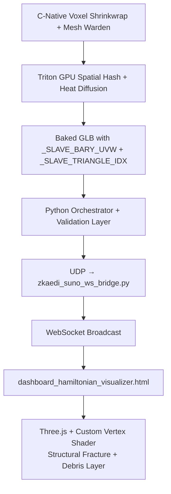

# ZKAEDI GPU-Native Rigger — Architecture & Pipeline Overview

**Status:** Production-Grade (Validated on real 2.7M+ vertex assets)  
**Last Updated:** 2026-05-14

## 1. Executive Summary

ZKAEDI is a full-stack, GPU-accelerated 3D rigging and real-time visualization system designed to handle extremely large meshes (500MB–10GB+) without traditional CPU-bound skinning or OOM failures.

**Core Philosophy:**

- Keep heavy geometry as a **passive slave** via barycentric mapping.
- Perform all heavy computation on the GPU (Triton + WebGL).
- Maintain structural coherence on chaotic AI-generated meshes.
- Enable real-time, audio-reactive visualization with cinematic post-processing.

## 2. High-Level Data Flow

## 3. Core Components

### 3.1 C-Native Layer

- **Voxel Shrinkwrap** (`zcc_voxel_shrinkwrap.c`)
- **Fixed-capacity per-voxel buffer** spatial indexing (64 triangles/voxel)
- **Mesh Warden integration shim**

### 3.2 Triton GPU Layer

- **Heat Diffusion** for bone weighting (`zkaedi_heat_diffusion.py`)
- **Fixed-Buffer Spatial Hash** with adaptive grid + distance-to-center culling
- Hybrid fallback (Triton + PyTorch) for 100% assignment guarantee

### 3.3 Baking & Export

- Custom GLB export with `_SLAVE_BARY_UVW` and `_SLAVE_TRIANGLE_IDX` attributes
- Post-processing normalization + quality reporting

### 3.4 Visualization Layer

- Three.js + custom `ShaderMaterial`
- GPU-side barycentric deformation using baked attributes
- Structural low-frequency fracture + micro debris noise
- Cinematic post-processing (chromatic aberration, scanlines, vignette)
- Real-time uniform control via WebSocket

### 3.5 Live Data Pipeline

- UDP (20-byte struct: `time, bass, treble, phase, chaos`)
- Python WebSocket bridge (`zkaedi_suno_ws_bridge.py`)
- Dynamic shader uniform updates (`uEnergyField`, `uPhase`, `uChaos`, audio reactivity)

## 4. Key Design Decisions

| Decision | Rationale |
| -------- | --------- |
| **Fixed per-voxel buffer (64)** | Predictable memory, no dynamic allocation pressure, aligns with C-native philosophy |
| **GPU-side barycentric deformation** | Avoids sending millions of vertices over the network |
| **Tolerance of negative weights** | Preserves spatial offset for floating debris, particles, and exterior geometry |
| **Hybrid Triton + PyTorch fallback** | Guarantees 100% vertex assignment even on difficult proxy meshes |
| **Structural (position-based) noise** | Prevents "porcupine explosion" on real AI-generated meshes with chaotic normals |

## 5. Performance Characteristics (Observed)

- **~5.27 seconds** to process a 2.7 million vertex / 165 MB asset
- **100% assignment rate** maintained via hybrid fallback
- **60+ FPS** in WebGL visualizer on high-end GPUs (even at 2.7M vertices)
- Memory usage remains stable due to fixed-buffer spatial hash design

## 6. Current Status (as of 2026-05-14)

- ✅ Full end-to-end pipeline functional
- ✅ Real rigged assets loading in visualizer
- ✅ Live audio + Hamiltonian parameter streaming
- ✅ Structural fracture shader with debris layer
- ✅ Proper error handling and loading states
- ✅ Architecture documented

## 7. Known Limitations & Future Work

- Batch processing of 100+ assets not yet stress-tested for long-running stability
- C-Native UDP sender needs integration into main orchestrator
- Potential for LOD or frustum culling on extremely large scenes in the visualizer

---

End of Document
